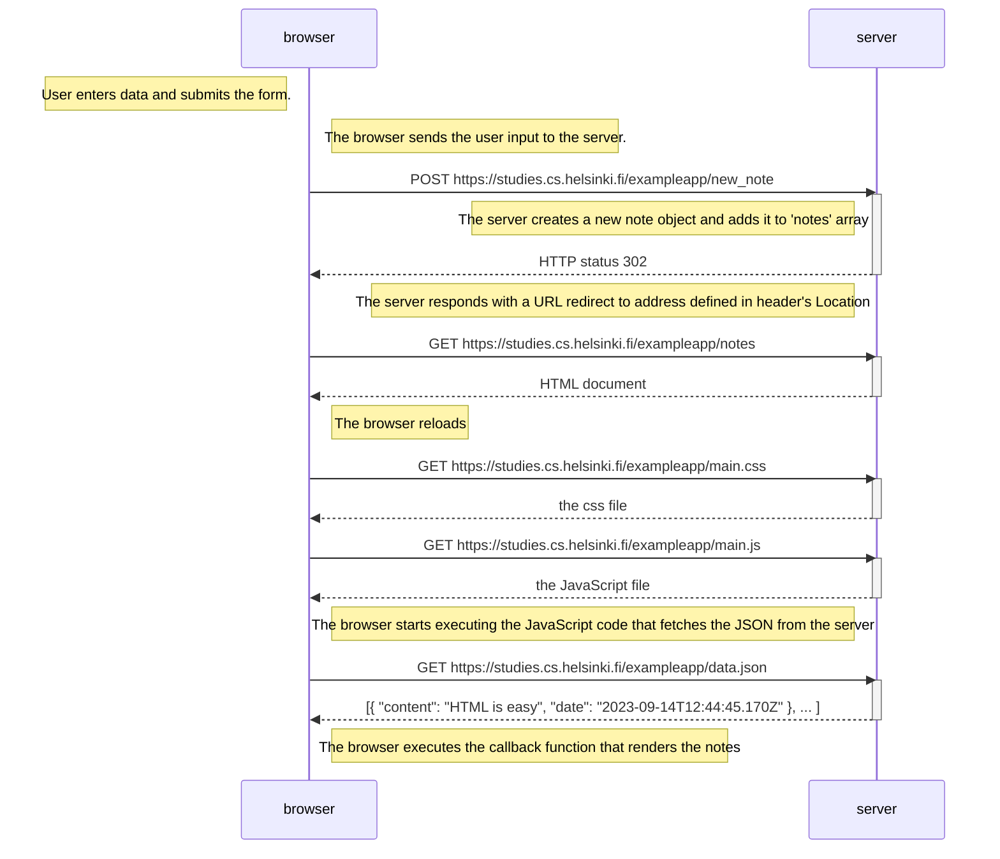

## Exercise 0.4: New Note Diagram

Sequence diagram depicting user creating a new note on notes app at https://studies.cs.helsinki.fi/exampleapp/notes

```mermaid
sequenceDiagram
    participant browser
    participant server

    Note left of browser:User enters data and submits the form.
    Note right of browser: The browser sends the user input to the server.
    browser->>server: POST https://studies.cs.helsinki.fi/exampleapp/new_note
    activate server
    Note left of server: The server creates a new note object and adds it to 'notes' array
    server-->>browser: HTTP status 302
    deactivate server
    Note left of server: The server responds with a URL redirect to address defined in header's Location
    browser->>server: GET https://studies.cs.helsinki.fi/exampleapp/notes
    activate server
    server-->>browser: HTML document
    deactivate server
    Note right of browser: The browser reloads

    browser->>server: GET https://studies.cs.helsinki.fi/exampleapp/main.css
    activate server
    server-->>browser: the css file
    deactivate server

    browser->>server: GET https://studies.cs.helsinki.fi/exampleapp/main.js
    activate server
    server-->>browser: the JavaScript file
    deactivate server

    Note right of browser: The browser starts executing the JavaScript code that fetches the JSON from the server

    browser->>server: GET https://studies.cs.helsinki.fi/exampleapp/data.json
    activate server
    server-->>browser: [{ "content": "HTML is easy", "date": "2023-09-14T12:44:45.170Z" }, ... ]
    deactivate server

    Note right of browser: The browser executes the callback function that renders the notes
```
